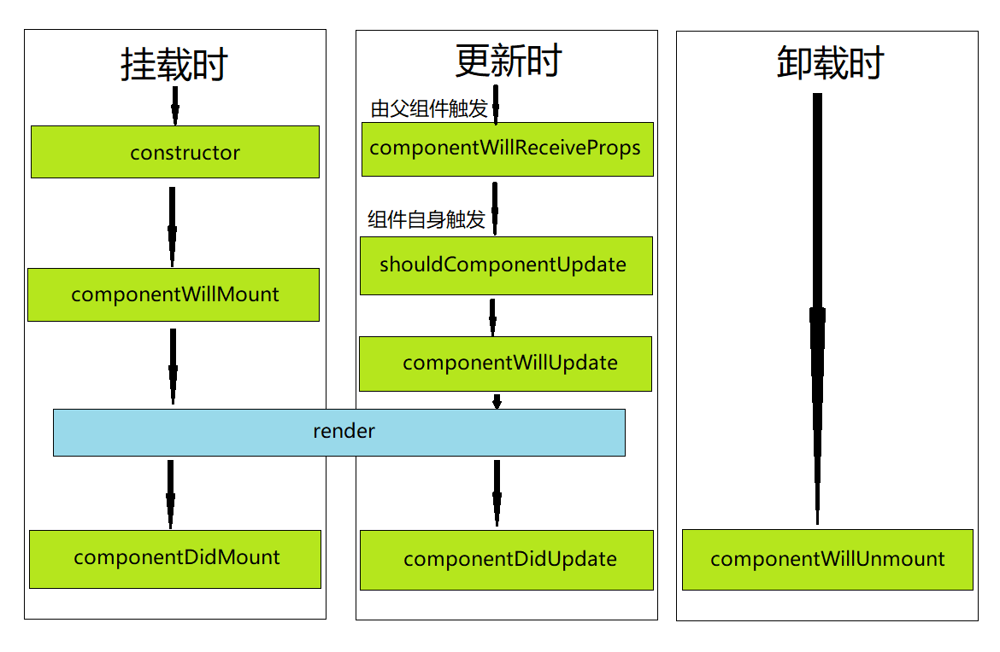
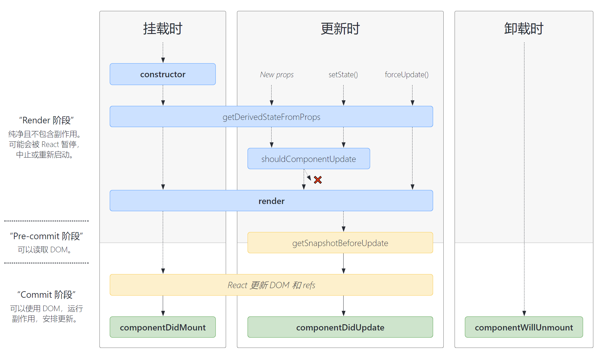

# 从React15到16的变化深入理解生命周期

在我们学习 React 的过程中，生命周期是十分重要的一个部分。

所谓生命周期，简单的说就是指一个事物的生老病死的全过程。React组件也有自己的生命周期，深入理解组件的生命周期可以让我们在最合适的地方完成自己所需的功能。

生命周期的整个过程中，会分成多个阶段，如挂载（Mount）、更新（Update）、卸载（Unmount）等。在每个阶段，React 会在组件内部提供一些回调函数供我们使用，这些函数就是生命周期函数。

> 当我们谈 React 的生命周期时，谈的是类组件的生命周期，因为函数式组件是没有生命周期函数的。

学习过 Vue 框架的同学都知道，Vue 的生命周期分为创建（create）、挂载(mount)、更新（update）和销毁（distroy）四个阶段，它的生命周期函数就是对应四个阶段前后一刻的回调函数。这些生命周期函数的命名是有规则的，在每个阶段之前一刻执行的函数其名称为 `before + 阶段名` 如 `beforeCreate`，在每个阶段后一刻执行的函数其名称为 `阶段名 + ed` 如`mounted`。四个阶段对应八个生命周期函数，非常容易理解和记忆。

而在React中，由于类组件基于`ES6`的`class`、并且还有一些设计思想上的原因，React 的生命周期并不向 Vue 那样好记和容易理解。此外，一些不安全的以及涉及到性能优化的生命周期函数更是使得React的生命周期学习难度进一步提升。

由此可见，在学习React时，我们并不能像学习Vue那样通过简单的背就能合理和正确的运用生命周期。要想成为一名合格的React开发者，我们必须对它的生命周期有一个全面而清晰的认识。

目前 React 的大版本为 17，它的最新的生命周期函数是在 16 版本中确定的。现如今的学习资料基本都是从 16 版本的生命周期开始学习，而在 15 到 16 的版本迭代中，生命周期发生了比较大的更改，对 15 和 16 版本的生命周期变化进行比较学习，更有助于我们深入的学习生命周期，进一步了解变化背后的原理和思想。

## React 15的生命周期

React 的生命周期主要分为挂载、更新和卸载三个阶段。

下面我将我们需要关注的生命周期函数画了一张图。



### 挂载阶段（初始化渲染）

挂载阶段在一个组件的生命周期中只会发生一次，在挂载阶段React会创建组件实例并插入到DOM中，其生命周期函数调用顺序如下：

1. constructor
2. componentWillMount
3. render
4. componentDidMount

#### constructor

constructor是类通用的构造函数，用于初始化。在以前，一般在constructor中进行 state 的初始化和函数的 this 绑定。而现在因为类属性开始流行，推荐去除constructor，将 state 和函数 this 绑定以类属性的方式来写，举个栗子：

```javascript
import React from 'react'

class Counter extends React.Component {
   state = {
      count: 0,
   }
   // 使用箭头函数
   handleClick = () => {
   	 
   }
   render() {
      return null
   }
}
```

推荐移除的constuctor的原因主要为：

+ constructor应该并不属于React的生命周期，它只是 Class 的构造函数
+ constructor中并不推荐去处理初始化意外的逻辑（防止骚操作），并且去除它会让代码更加简洁。

#### componentWillMount

该函数在 render 函数执行之前被触发，在该函数之中进行初始化操作将有一定的风险。具体原因将在下文进行讲解。

在 React 16 中，该函数被移除（准确的说是被标记为 UNSAFE，应避免使用）。

#### render

render 是非常重要的一个生命周期函数，被誉为组件的“灵魂”。

> 注意：此处指的是组件的 render 生命周期函数，跟ReactDOM.rendor方法无关。

render 是 class 组件中唯一一个必须实现的方法。

render 的作用是**生成虚拟DOM**（注意它的作用不是真正的去渲染组件），之后会通过 ReactDOM.render 方法将虚拟 DOM 转化为真实 DOM 。在组件更新之后，也会调用 render 生命周期函数来生成新的虚拟 DOM，并通过 Diff 算法进行新旧虚拟 DOM 的对比，从而对发生变化的真实 DOM 做更新。

还有一点需要注意：`render()` 函数应该为纯函数，这意味着在不修改组件 state 的情况下，每次调用时都返回相同的结果，并且它不会直接与浏览器交互——来自官方文档。render应该为纯函数，所以不应该在它里面产生副作用，如调用 setState 或绑定事件。

#### componentDidMount

该函数在渲染之后被调用，（在浏览器端）此时DOM已经挂载完成，我们可以在这个生命周期函数中执行DOM相关的操作以及异步请求或者数据初始化等。

> 在React Native 场景下，componentDidMount并不一定真实的页面已经绘制完成，由于机器性能所限，有可能还在绘制中。

以上就是 React 15中挂载阶段执行的四个生命周期函数，需要注意的是，constructor / componentWillMount / componentDidMount 只会执行一次，而 render在更新阶段也会执行。

### 更新阶段

更新阶段指的是外部props传入或者内部state发生变化而使组件更新。换句话说，可能是父组件触发的更新，也可能是组件自身触发更新。

更新阶段触发的生命周期函数调用顺序如下：

1. componentWillReceiveProps  （父组件触发更新）
2. shouldComponentUpdate（组件自身触发更新）
3. componentWillUpdate
4. render
5. componentDidUpdate

#### componentWillReceiveProps

在上文提供的 React 15 生命周期大图有标明两种触发的情况，其中，父组件触发更新会多一个 componentWillReceiveProps 函数。

```javascript
componentWillReceiveProps(nextProps)
```

在这个函数中，`nextProps` 是变化后的 props，变化前的 props 可以通过 `this.props`拿到，通过两者对比可以知道 props 的变化。

非常重要的一点：该函数的调用并不一定是**父组件传入的 props **发生了变化，如果父组件其他的 state 发生变化，也会使该函数被调用。

> 如果父组件导致组件重新渲染，即使 props 没有更改，也会调用此方法。如果只想处理更改，请确保进行当前值与变更值的比较。——官方文档

该函数在 React 16中被移除（标记为UNSAFE）。

#### shouldComponentUpdate

```javascript
shouldComponentUpdate(nextProps, nextState)
```

React 会通过该函数返回的布尔值来确定组件是否需要更新，是开发者可以手动控制性能优化的一个方法。这种性能优化的方式简称为 SCU 优化。

我们可以用参数提供的 nextProps 和 nextState 来讲新旧 props 与 state 进行浅比较，用来判断是否触发更新。

> PureComponent 的核心原理就是默认实现了 shouldComponentUpdate 函数。

#### componentWillUpdate

该函数在 render 函数执行前被触发，与 componentWillMount 的作用类似。

该函数在 React 16中被移除（标记为UNSAFE）。

#### render

在挂载阶段已经提到，render 在更新阶段会用 diff 算法 比较新旧虚拟 DOM。

#### componentDidUpdate

render 之后执行，此时更新已经完成，可以在该函数中书写更新后调用的逻辑。

### 卸载阶段

#### componentWillUnmount

卸载阶段只有 componentWillUnmount 一个生命周期函数，该函数主要用于在组件卸载前执行清理操作，例如取消定时器以及解除事件绑定等。

## React 16的生命周期

React 16 的生命周期也是分为挂载、渲染和卸载三个阶段。我们主要关注React 16相较于 15 发生变化的生命周期函数，对于其中和React 15作用一致的生命周期函数将不再讲解。

先上图：



### 挂载阶段

由图可以看出在挂载阶段，取消了 componentWillMount 函数，新增了 getDerivedStateFromProps 函数。

getDerivedStateFromProps 并不是 componentWillMount 的替代，取消掉 componentWillMount 主要的原因是在其中执行的操作有一定危险性，并且挂载阶段的操作应该在 componentDidMount 中进行。

由于 getDerivedStateFromProps 函数在更新阶段也会执行，所以在下文一起详细分析。

### 更新阶段

在更新阶段，React 16移除了 componentWillReceiveProps，新增了 getDerivedStateFromProps 函数；在render 与 componentDidUpdate 过程中间新增了 getSnapshotBeforeUpdate 函数。

#### getDerivedStateFromProps

前面提到，getDerivedStateFromProps 并不是 componentWillMount 的替代品，官方描述它是更新阶段的 componentWillReceiveProps 的替代品。

首先我们先从字面意思来理解一下这个函数，它的意思是**从props中派生state**，换种描述就是说 **让组件在props变化时更新state**。

它的使用方式如下：

``` javascript
static getDerivedStateFromProps(props, state)
```

与其他大多数生命周期函数不同的是，它是一个静态方法，这意味着在其中我们是拿不到 `this` 的，这个强制性的措施也是用来确保开发者不在这个生命周期函数中进行派生 state 之外的*骚操作*。

该函数的提供的两个参数分别是来自父组件的 props 和组件自身的 state。派生 state 时，要在该函数中返回一个对象，对象里面的属性为派生的 state。该函数派生 state 是**增量更新**的方式，增加新的 state 而不会覆盖掉原来的 state。这个函数要求必须有返回值，没有返回值React将发出一个 warning，如果不需要派生 state，则不要写这个生命周期函数（头铁实在要写也要返回 null）。

getDerivedStateFromProps 对 componentWillReceiveProps 做了减法，增强了安全性，使该函数只专注于派生 state 一种操作，是官方提供的最佳实践。

另外关于派生state官方还提供了一篇文章，此处贴链接以供学习：

[你可能不需要派生state](ttps://react.docschina.org/blog/2018/06/07/you-probably-dont-need-derived-state.html#when-to-use-derived-state)

#### getSnapshotBeforeUpdate

根据函数名可简单翻译为“更新前的快照”，该函数的执行时机在 render 之后，React 更新 DOM 之前，它的返回值将作为 componentDidUpdate 的第三个参数。

在该函数中，我们可以获取到更新前的DOM以及更新前后的state与props。

### 卸载阶段

未变化，不赘述。

## 15到16生命周期变化的最大原因

React 15 到 React 16 的一个重大升级就是将核心算法 Stack Reconciler 改为 Fiber Reconciler。

Reconciler 译为 调和，调和指的是将虚拟 DOM 映射到真实 DOM 的过程。由于“调和”细讲内容过多，此处只简略的说和本文相关的核心内容。

React 15的 Stack Reconciler 是一个同步递归的过程，如果计算时间过长，js 线程将长时间的占用主线程，会导致页面渲染的卡顿、卡死等问题。而 React 16 的 Fiber Reconciler 会将一个渲染任务分解为多个渲染任务，然后分散到多个帧里面，这是一个异步的过程。通过 Fiber 架构，渲染任务可中断、可恢复，也可以给不同的任务赋予不同的优先级。

再次祭出大图：


我们可以看到，左边将生命周期分为了三个阶段：

+ Render 阶段：纯净且不含副作用，可能会被 React暂停，中止或重新启动
+ Pre-commit 阶段：可以读取DOM
+ Commit 阶段：可以使用DOM，运行副作用，安排更新

从上文的对比中我们可以发现，React 16 （将）废弃以下三个生命周期函数：

+ componentWillMount
+ componentWillReceiveProps
+ componentWillUpdate

通过对 调和 算法的变更的简要了解，我们可以清晰的得出结论：

React 16 改造生命周期主要时为了配合 Fiber 架构的异步渲染机制。

在 React 16 的 Fiber 架构下，render 阶段的任务被分解成小任务，小任务有不同的优先级，React可以根据优先级的高低去实现任务的打断和恢复。render 阶段的操作对用户是不可见的，所以暂停、中断或重启也没有问题，而 commit 阶段是同步执行的，渲染了真实的DOM。由于 render  阶段可以暂停或重启，这导致 render 阶段的生命周期可能被重复执行。

将被废弃的三个生命周期都是处于 render 阶段，都可能会被重复执行，这可能会导致很严重的后果。

React 16 为要废弃的这些生命周期，也提供了安全的转移方法。

通过对生命周期的改动，确保了 Fiber 架构下数据与渲染的安全性，也使生命周期函数更加纯粹、可控、可预测。

> 参考资料：深入浅出搞定 React ——修言

